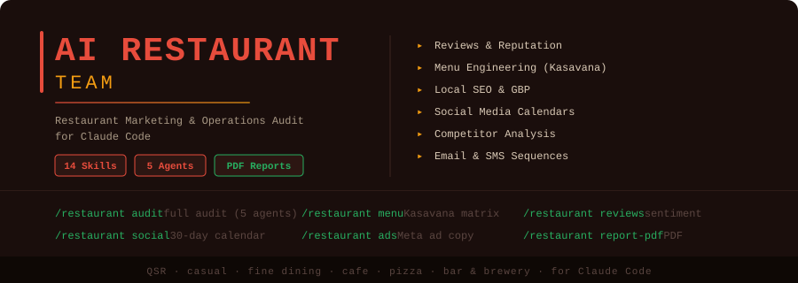

<p align="center">
  
</p>

<p align="center">
  <strong>AI-powered restaurant marketing and operations audit</strong> for Claude Code.<br/>
  Audit any restaurant's reviews, menu, online presence, and competitors — and generate a client-ready PDF report in minutes.
</p>

<p align="center">
  <a href="#quick-start"></a>
  
  
  
  
</p>

---

## Why This Exists

Most independent restaurants in the US lose **$5,000-$25,000 per month** to four invisible problems:

1. **Unanswered negative reviews** silently drop their star rating
2. **Menu engineering blind spots** leave $2-5 per cover on the table
3. **Online presence gaps** cause new-customer searches to land on competitors
4. **Marketing dormancy** turns Instagram followers and email lists into dead assets

Restaurant marketing agencies charge **$1,500-$10,000/month** to fix these issues — and most owners can't afford that. The AI Restaurant Team turns Claude Code into a full restaurant marketing agency you can run from the command line. Run a full audit on any restaurant in 2 minutes and produce a polished, client-ready PDF report.

---

## What It Does

The AI Restaurant Team launches **5 parallel AI agents** to analyze any restaurant across:

| Agent | Weight | What It Measures |
|-------|--------|------------------|
| **Reviews & Reputation** | 25% | Star ratings, review volume, owner response rate, sentiment patterns, rating trajectory |
| **Menu & Pricing** | 20% | Kasavana menu engineering, description quality, pricing psychology, photo presence |
| **Online Presence** | 20% | GBP completeness, Yelp quality, website, delivery apps, NAP consistency |
| **Marketing & Engagement** | 15% | Social cadence, content quality, email/SMS, loyalty, community marketing |
| **Local Competition** | 20% | Head-to-head with top 5 local competitors, positioning gaps |

It then produces a composite **Restaurant Health Score (0-100)** with letter grade and a prioritized 90-day action plan.

### Feature Highlights

| Feature | Description |
|---------|-------------|
| **Full Restaurant Audit** | 5 parallel agents analyze every angle simultaneously |
| **Restaurant Health Score** | Weighted composite 0-100 with A+ to F grade and signal |
| **Multi-Platform Review Analysis** | Google, Yelp, TripAdvisor, DoorDash sentiment + trend |
| **Review Response Generator** | Personalized HEART-framework replies for every review |
| **Menu Engineering** | Kasavana matrix (Stars/Plowhorses/Puzzles/Dogs) with pricing recs |
| **Online Presence Audit** | GBP, Yelp, website, schema, NAP consistency check |
| **Food Photography Audit** | Shot list + photographer brief, ready to send |
| **30-Day Social Calendar** | Daily IG/TikTok/FB content with captions + hashtags |
| **Local SEO Strategy** | "Best [cuisine] near me" targeting with ready schema markup |
| **Facebook/Instagram Ad Copy** | 10 angles × 2 variants each, A/B testing framework |
| **Email & SMS Sequences** | Welcome, birthday, win-back, abandoned cart, loyalty |
| **Competitor Analysis** | Head-to-head with top 5 local competitors |
| **PDF Reports** | Professional 9-page reports with score gauge, charts, action plan |

---

## Quick Start

### One-Command Install (macOS / Linux)

```bash
curl -fsSL https://raw.githubusercontent.com/zubair-trabzada/ai-restaurant-claude/main/install.sh | bash
```

### Manual Install

```bash
git clone https://github.com/zubair-trabzada/ai-restaurant-claude.git
cd ai-restaurant-claude
./install.sh
```

### Requirements

- Python 3.8+
- Claude Code CLI
- Git
- `reportlab` (installed automatically)

---

## Commands

Open Claude Code and use these commands:

| Command | What It Does | Output |
|---------|-------------|--------|
| `/restaurant audit <name>` | Full audit (5 parallel agents) | `RESTAURANT-AUDIT-*.md` |
| `/restaurant quick <name>` | 60-second restaurant snapshot | Terminal output |
| `/restaurant reviews <name>` | Multi-platform review analysis | `RESTAURANT-REVIEWS-*.md` |
| `/restaurant respond <name>` | Generate personalized review responses | `RESTAURANT-RESPONSES-*.md` |
| `/restaurant menu <url>` | Menu engineering & pricing analysis | `RESTAURANT-MENU-*.md` |
| `/restaurant pricing <name>` | Competitive pricing analysis | `RESTAURANT-PRICING-*.md` |
| `/restaurant online <name>` | Online presence audit | `RESTAURANT-ONLINE-*.md` |
| `/restaurant photos <name>` | Food photography audit & shot list | `RESTAURANT-PHOTOS-*.md` |
| `/restaurant social <name>` | 30-day social media calendar | `RESTAURANT-SOCIAL-*.md` |
| `/restaurant local-seo <name>` | Local SEO audit & strategy | `RESTAURANT-SEO-*.md` |
| `/restaurant ads <name>` | Facebook/Instagram ad copy variants | `RESTAURANT-ADS-*.md` |
| `/restaurant email <name>` | Email & SMS loyalty sequences | `RESTAURANT-EMAIL-*.md` |
| `/restaurant competitors <name>` | Top 5 local competitor analysis | `RESTAURANT-COMPETITORS-*.md` |
| `/restaurant report-pdf` | Professional PDF restaurant report | `RESTAURANT-REPORT.pdf` |

---

## How It Works — The 5 Parallel Agents

When you run `/restaurant audit <name>`, the orchestrator:

1. **Phase 1 — Restaurant Discovery (20-30s):** Locates the restaurant on Google, Yelp, TripAdvisor, delivery platforms. Captures cuisine, type, price tier, hours, contact info, and key ratings.

2. **Phase 2 — Launch 5 Parallel Agents (60-90s):**
   - **restaurant-reviews** — Reads recent reviews across platforms, identifies themes, scores reputation
   - **restaurant-menu** — Acquires menu, applies Kasavana matrix, analyzes pricing psychology
   - **restaurant-presence** — Audits GBP, Yelp, website, delivery, NAP consistency
   - **restaurant-marketing** — Evaluates social cadence, content quality, retention programs
   - **restaurant-competition** — Identifies 5 direct competitors, builds head-to-head scorecard

3. **Phase 3 — Synthesis (20-30s):** Computes composite Restaurant Health Score, generates 90-day action plan, projects revenue opportunity.

Total runtime: **2-3 minutes** for a complete audit.

---

## Scoring Methodology

The **Restaurant Health Score (0-100)** is a weighted composite:

| Category | Weight | What It Measures |
|----------|--------|------------------|
| Reviews & Reputation | 25% | Star ratings, volume, response rate, sentiment, trajectory |
| Online Presence | 20% | GBP, Yelp, website, third-party platforms, NAP |
| Menu & Pricing | 20% | Menu engineering, pricing psychology, photos, upsells |
| Local Competition | 20% | Position vs top 5 local competitors |
| Marketing & Engagement | 15% | Social, ads, email, loyalty, community |

### Grade & Signal

| Score | Grade | Signal |
|-------|-------|--------|
| 85-100 | A+ | **Excellent** — minor optimizations only |
| 70-84 | A | **Strong** — some areas need attention |
| 55-69 | B | **Average** — significant opportunities |
| 40-54 | C | **Below Average** — multiple critical issues |
| 25-39 | D | **Poor** — losing customers daily |
| 0-24 | F | **Critical** — losing money every day to competitors |

---

## Restaurant Types Supported

| Type | Key Analysis Focus |
|------|-------------------|
| **Quick Service (QSR)** | Drive-thru speed, app ordering, delivery integrations, value perception |
| **Casual Dining** | Ambiance, wait times, family-friendly, menu variety |
| **Fine Dining** | Reservations, wine list, chef positioning, special occasion marketing |
| **Cafe / Coffee Shop** | Morning rush, wifi/work signals, loyalty, food pairing |
| **Pizza / Delivery** | Delivery times, third-party platform ratings, large order discounts |
| **Ethnic Cuisine** | Authenticity signals, cultural marketing, neighborhood positioning |
| **Bar / Brewery** | Happy hour, events, age demographics, food pairing |

---

## Use Cases

### Restaurant Owners
- Diagnose what's hurting your star rating (and fix it)
- Find the menu items leaving money on the table (Kasavana matrix)
- See exactly where you trail competitors and how to close the gap
- Get a 30-day social media calendar so the page never goes dormant

### Restaurant Marketing Agencies
- Audit prospects in 3 minutes during sales calls
- Generate client-ready PDF reports for proposals
- Identify $5K-$25K/month revenue lifts to sell against
- Scale from 5 to 50 clients without hiring more analysts

### Restaurant Consultants
- Onboard new clients with a comprehensive audit (replaces 2 weeks of manual research)
- Re-audit quarterly to track progress
- Generate deliverables that justify retainer fees

### Multi-Unit Operators
- Audit every location consistently with the same methodology
- Benchmark stores against each other and against local competitors
- Roll up insights for portfolio-wide marketing decisions

### Investors / Acquirers
- Due diligence on a restaurant acquisition target
- Validate marketing health before committing capital
- Identify upside opportunities for the post-acquisition plan

---

## Example Output

```
/restaurant quick Bella Italia Trattoria Austin

============================================================
  RESTAURANT SNAPSHOT | May 20, 2026
  Bella Italia Trattoria — Austin, TX
============================================================

  Cuisine:    Italian              Type:    Casual Dining
  Price:      $$                   Years:   Since 2014
  Google:     4.2 stars (412 reviews)
  Yelp:       3.9 stars (287 reviews)
  Last Insta: 12 days ago

------------------------------------------------------------
  GRADE: B — Average — strong food, weak digital
------------------------------------------------------------

  Dimension          Rating
  ---------          ------
  Reviews            B  — 4.2 stars but 12% response rate (top decile = 100%)
  Online Presence    Weak — no online order link on GBP, NAP mismatches
  Menu               Moderate — competitively priced but only 58% have photos
  Social Media       Stale — 3 posts in 30 days, 0 Reels, TikTok dormant
  Local Discovery    Buried — not in map pack for "best Italian Austin"

------------------------------------------------------------
  TOP 3 PRIORITY FIXES
------------------------------------------------------------
  1. Reply to 14 unanswered negative reviews (likely +0.2 stars in 90 days)
  2. Add online ordering link to Google Business Profile (5 min, +$2K-4K/mo)
  3. Launch weekly Instagram Reels (4 weeks to 3x reach)

------------------------------------------------------------
  REVENUE OPPORTUNITY
------------------------------------------------------------
  Estimated lift if top 3 fixes done: +$5,500-$11,000/month

  VERDICT: Strong food fundamentals undermined by digital
  invisibility. Easy 20%+ revenue lift available in 90 days.

  Want the full audit? Run: /restaurant audit Bella Italia Trattoria
============================================================
```

---

## Project Structure

```
ai-restaurant-claude/
├── restaurant/                       # Main skill orchestrator
│   └── SKILL.md
├── skills/                           # 14 sub-skills
│   ├── restaurant-audit/             # Full audit (5 parallel agents)
│   ├── restaurant-quick/             # 60-second snapshot
│   ├── restaurant-reviews/           # Multi-platform review analysis
│   ├── restaurant-respond/           # Review response generator
│   ├── restaurant-menu/              # Menu engineering
│   ├── restaurant-pricing/           # Competitive pricing
│   ├── restaurant-online/            # Online presence audit
│   ├── restaurant-photos/            # Food photography audit
│   ├── restaurant-social/            # 30-day social calendar
│   ├── restaurant-local-seo/         # Local SEO strategy
│   ├── restaurant-ads/               # Meta ad copy
│   ├── restaurant-email/             # Email & SMS sequences
│   ├── restaurant-competitors/       # Competitor analysis
│   └── restaurant-report-pdf/        # PDF report generation
├── agents/                           # 5 parallel subagents
│   ├── restaurant-reviews.md
│   ├── restaurant-menu.md
│   ├── restaurant-presence.md
│   ├── restaurant-marketing.md
│   └── restaurant-competition.md
├── scripts/
│   └── generate_restaurant_pdf.py    # PDF report generator (ReportLab)
├── install.sh
├── uninstall.sh
├── requirements.txt
└── README.md
```

---

## PDF Reports

Generate professional 9-page restaurant reports with:

- **Cover page** with Restaurant Health Score gauge (color-coded 0-100)
- **Score dashboard** with bar chart and category breakdown
- **Reviews & reputation** with platform table + top complaints/praises
- **Menu engineering** with Kasavana matrix, pricing position, quick wins
- **Online presence audit** with channel health and critical gaps
- **Marketing recommendations** with audit table and 30-day push
- **Competitor comparison** with head-to-head scorecard and positioning gaps
- **90-day action plan** with Week 1 / Days 8-30 / Days 31-90 phases
- **Revenue opportunity summary** with itemized monthly lift estimates

Color scheme: Warm red (#e74c3c), Orange (#f39c12), Green (#27ae60)

```bash
# Generate a sample PDF report
python3 ~/.claude/skills/restaurant/scripts/generate_restaurant_pdf.py --demo
```

---

## Want to Sell This as a Service?

Restaurant marketing agencies charge $1,500-$10,000/month for what this tool produces in 3 minutes. Here's the pricing playbook:

### Productized Service Pricing

| Package | What's Included | Recommended Price |
|---------|------------------|-------------------|
| **Audit (one-time)** | Full audit + PDF report + 30-min walkthrough call | $497-$997 |
| **Starter Retainer** | Monthly audit + review responses + 4 social posts/wk | $1,500/mo |
| **Growth Retainer** | Starter + Meta ads management ($500-$1,500 spend) + monthly content | $2,500/mo |
| **Full Marketing** | Growth + email/SMS automation + loyalty setup + monthly photography | $3,000-$5,000/mo |
| **Multi-Unit** | All of the above × locations | $1,000-$1,500/location/mo |

### Where to Find Clients

1. **Run audits on free Yelp/Google leads** — restaurants with 50-150 reviews, 3.5-4.0 stars (the sweet spot). They feel the pain, can afford the fix.
2. **Cold email with the audit attached** — "I noticed [specific finding from audit]. Here's the full report. Want to talk?"
3. **Local restaurant Facebook groups** — share generic insights, DM owners privately
4. **Restaurant industry conferences** — NRA, regional events
5. **Partner with restaurant POS resellers** (Toast, Square) — they want add-on services

### Sales Conversion Tips

- Lead with the **revenue opportunity number** ("I found $8,400/month you're leaving on the table")
- Show the **PDF report on the call** — it justifies the price
- Always offer a **paid audit first** ($497) — converts at 30-50% to retainer
- For the audit close, position retainer at **3x audit price** (anchoring)

**Average agency revenue per client: $24,000-$60,000/year.** Six clients = a real business.

[Join the AI Workshop community to learn the full playbook](https://skool.com/aiworkshop)

---

## Related Tools

Built by the same author — all share the same Claude Code skill architecture:

- [ai-realestate-claude](https://github.com/zubair-trabzada/ai-realestate-claude) — Property research & investment analysis
- [ai-finance-claude](https://github.com/zubair-trabzada/ai-finance-claude) — Personal finance & retirement planning
- [ai-reputation-claude](https://github.com/zubair-trabzada/ai-reputation-claude) — Reputation management for any business
- [geo-seo-claude](https://github.com/zubair-trabzada/geo-seo-claude) — GEO + SEO audit for websites
- [ai-trading-claude](https://github.com/zubair-trabzada/ai-trading-claude) — Stock & options analysis
- [ai-crypto-claude](https://github.com/zubair-trabzada/ai-crypto-claude) — Cryptocurrency analysis
- [ai-sales-claude](https://github.com/zubair-trabzada/ai-sales-claude) — Prospect research & sales prep
- [ai-marketing-claude](https://github.com/zubair-trabzada/ai-marketing-claude) — Full marketing strategy
- [ai-legal-claude](https://github.com/zubair-trabzada/ai-legal-claude) — Contract review & legal docs
- [ai-ads-claude](https://github.com/zubair-trabzada/ai-ads-claude) — Paid ads strategist

---

## Contributing

1. Fork the repository
2. Create your feature branch (`git checkout -b feature/new-skill`)
3. Commit your changes (`git commit -m 'Add new skill'`)
4. Push to the branch (`git push origin feature/new-skill`)
5. Open a Pull Request

---

## License

MIT License. See [LICENSE](LICENSE) for details.

---

## Disclaimer

This tool is for **educational and research purposes only**. All audit findings, scores, and recommendations are AI-generated approximations based on publicly available data. Restaurant marketing is highly local and context-dependent — recommendations should be validated with the restaurant owner before implementation. Pricing changes, menu changes, and marketing spend decisions involve real financial risk. The authors accept no liability for any losses incurred from reliance on this report.

Always verify:
- Review platform terms of service before automated scraping
- Local advertising laws (especially for alcohol-related promotions)
- TCPA / CAN-SPAM compliance before launching SMS or email campaigns
- Health and safety implications of any operational change

---

<p align="center">
  Built for <a href="https://claude.com/claude-code">Claude Code</a>
</p>
