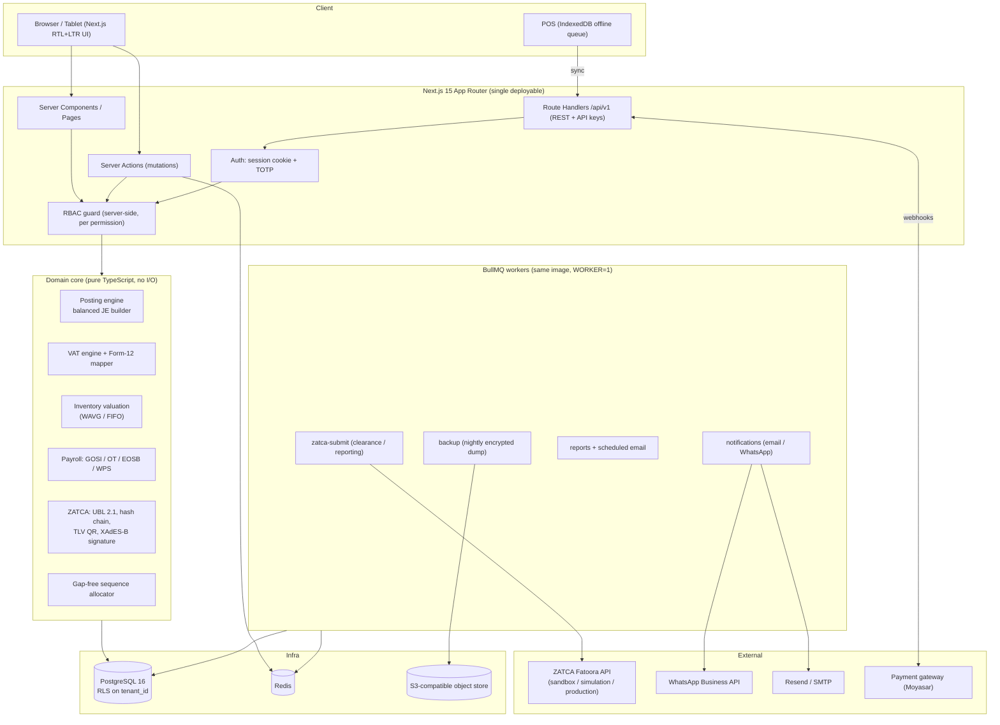

# Architecture — Nakhla ERP (KSA Small Business ERP)

## 1. System diagram



## 2. Layering rules (enforced by review + tests)

| Layer | Path | May import | Never |
|---|---|---|---|
| Domain core | `src/lib/**` | other domain modules, `decimal.js` | Prisma, `next/*`, `fetch`, env |
| Services | `src/server/services/**` | domain core, Prisma, repositories | React |
| Actions/API | `src/app/**`, `src/server/actions/**` | services, RBAC guard | domain internals directly for money math |
| UI | `src/components/**` | presentational only | Prisma, secrets |

**The ledger rule.** No module writes `JournalEntry`/`JournalLine` rows itself. Every module builds a
`PostingRequest` (a description of the business event) and hands it to
`src/server/services/posting.ts`, which calls the domain posting engine, validates
(balanced, period open, accounts exist, tenant match) and writes the entry inside the *same*
database transaction as the source document. A document and its GL effect are therefore atomic.

## 3. Money and quantity

* Money: `NUMERIC(18,4)` in PostgreSQL, `decimal.js` in the domain, never `number`.
* Quantity: `NUMERIC(18,6)`.
* Rounding: half-up to 2 decimals at the **document total** level only; line-level values keep 4 dp
  so that a 3-line invoice never drifts by a halala. See `src/lib/money.ts`.
* Currency: SAR base. Foreign-currency documents store both original and SAR amounts; realised
  FX difference posts to 7100/7200 on settlement.

## 4. Multi-tenancy

`tenant_id UUID NOT NULL` on every business table. Two guards, belt and braces:

1. **Application:** every repository call goes through `withTenant(tenantId)` which injects the
   predicate; a query builder helper fails loudly if `tenant_id` is missing.
2. **Database:** PostgreSQL RLS policies keyed on `current_setting('app.tenant_id')`, set per
   connection checkout in `src/server/db.ts`. Migration `20260101000100_rls` enables it.

## 5. Request lifecycle (posting a tax invoice)

```
POST /invoices/:id/post
  → RBAC: requires sales.invoice.post
  → tx BEGIN
      → sequence.allocate('INVOICE', branch)      -- gap-free, row-locked
      → invoice.status = POSTED, number assigned
      → stock: consume lines (WAVG/FIFO) → StockMovement rows
      → posting.post(buildInvoicePosting(...))    -- AR / Revenue / VAT Output / COGS / Inventory
      → zatca.enqueue(invoice)                    -- writes ZatcaSubmission(PENDING)
  → tx COMMIT
  → BullMQ picks up submission → clearance (B2B) or reporting (B2C)
```

If ZATCA rejects, the invoice keeps its number and GL effect (it legally exists) and the submission
row carries `status=REJECTED` plus the raw ZATCA payload, surfaced in the UI. Errors are never
swallowed — see `DECISIONS.md` §D-014.

## 6. Offline POS

IndexedDB holds `pending_sales`. Each sale carries a client-generated `idempotency_key` (UUID v4).
On reconnect the client replays to `POST /api/v1/pos/sync`; the server upserts on
`(tenant_id, idempotency_key)` so a replayed batch can never double-post. Conflicts (e.g. price
changed while offline) resolve **server wins**, and the difference is written to the sync log shown
in the POS session close report.

## 7. Deployment

One Docker image, three run modes: `web` (Next.js), `worker` (BullMQ), `migrate` (Prisma deploy).
`docker-compose.yml` for local (Postgres + Redis + MinIO + app), `docker-compose.prod.yml` for a
single-host production deployment behind a TLS terminator. See `README.md`.
