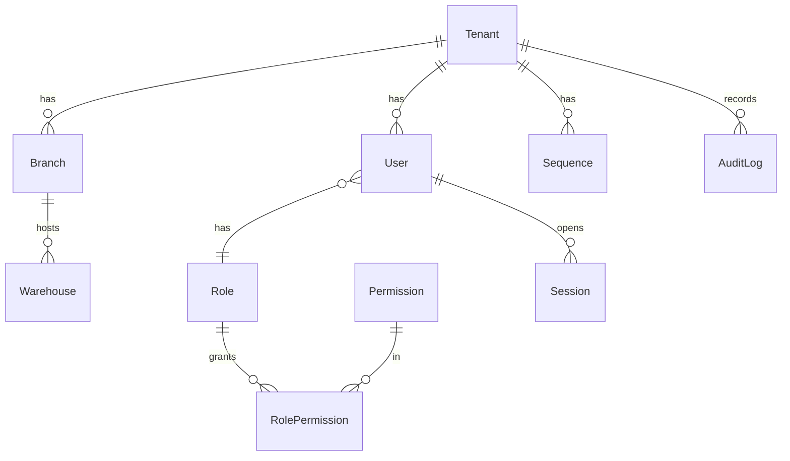
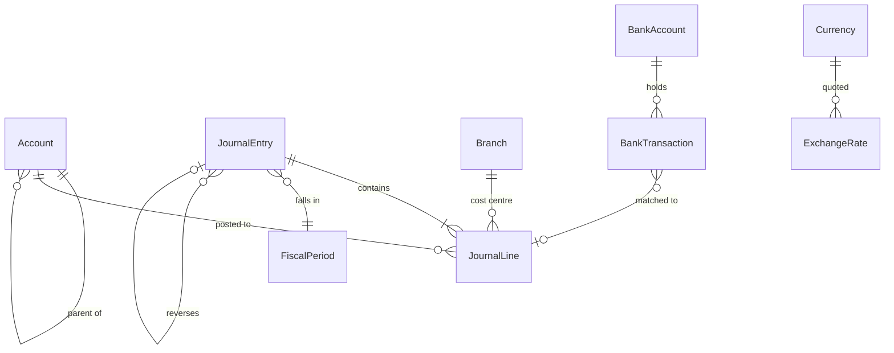
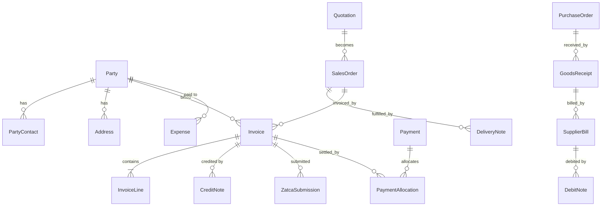
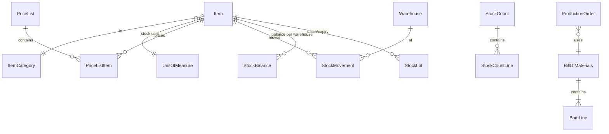
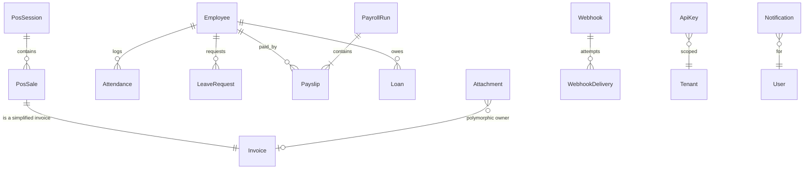

# ERD — Nakhla ERP

Every table carries: `id uuid pk`, `tenant_id uuid`, `created_at`, `created_by`, `updated_at`,
`updated_by`, and `deleted_at` (soft delete permitted **only** while a document is in `DRAFT`).
Money is `NUMERIC(18,4)`; quantity is `NUMERIC(18,6)`.

## Core & settings

## Ledger

`JournalEntry.status ∈ {DRAFT, POSTED, REVERSED}`. Constraint: sum(debit) = sum(credit) per entry,
checked in the domain **and** by a deferred DB trigger (`assert_entry_balanced`).

## Sales, purchasing, parties

## Inventory & production

`StockMovement` is append-only and is the sole source of `StockBalance` (kept as a materialised
running balance, rebuildable by `pnpm stock:rebuild`).

## POS, HR, platform

## Key invariants

| # | Invariant | Enforced by |
|---|---|---|
| I1 | Σ debit = Σ credit per journal entry | domain + DB trigger + `tests/unit/posting.test.ts` |
| I2 | Trial balance nets to zero for any tenant, any date | `tests/unit/invariants.test.ts` |
| I3 | Tax-invoice numbers are gap-free per (tenant, type, branch, year) | row-locked `Sequence` + test |
| I4 | `ZatcaSubmission.icv` strictly increments; `pih` = hash of previous invoice | `tests/unit/zatca-chain.test.ts` |
| I5 | Posted documents are immutable | status guard + audit log + test |
| I6 | Nothing posts into a `CLOSED` fiscal period | posting engine + test |
| I7 | Stock balance = Σ movements, per (item, warehouse) | rebuild command + test |
